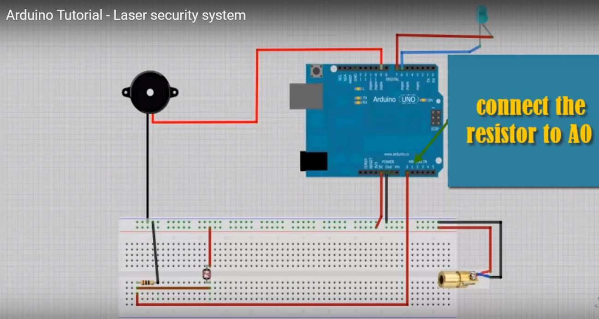

# SecurityLaserTrap
This work is aimed to improve what has been done in this youtube link 
https://www.youtube.com/watch?v=AmZJkF9jBwo&amp;t=90s which is created by Blue Matter. The difference that was made in this project is that
we do not have to use buzzer. Instead, we will combine Processing and Arduino to generate alarm sound from the pc speaker when there is an object blocking the laser light.

# How to run
First, make sure you already have the arrangement as can be seen in the following figure. (I crop it from the youtube link, the buzzer is not necessary)

Second, run the arduino program, make sure the arduino has been plugged to the pc. Wait for about 5 seconds.
Third, run the Processing. The laser security alarm is ready to use. To change the alarm sound, substitute the mp3 file in the data folder
